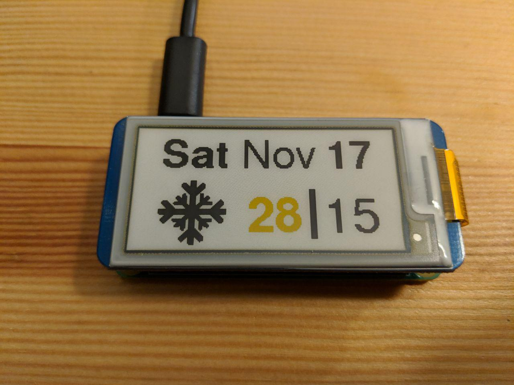

# weatherPi
Raspberrry Pi Zero W with a 2.13in yellow/black/white e-ink screen to show date and weather information

Weather information from Yahoo

Started fromthe Inky pHat weather exameple: https://learn.pimoroni.com/tutorial/sandyj/getting-started-with-inky-phat

Waveshare e-ink library from: https://www.waveshare.com/wiki/2.13inch_e-Paper_HAT_(B)

Icons edited from: https://www.freepik.com/free-vector/weather-icons-collection_1044316.htm#term=weather&page=1&position=2